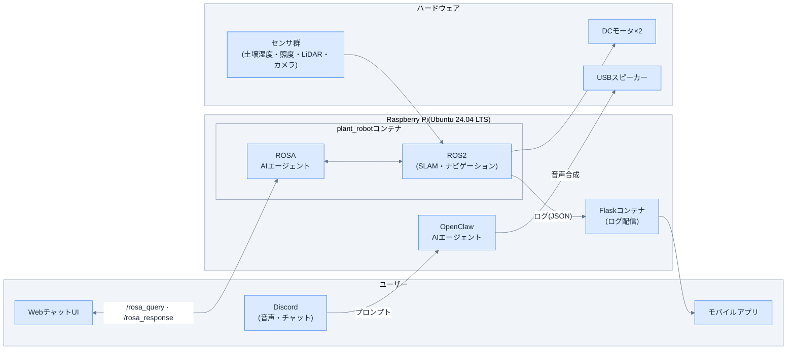

## はじめに

セカンドセレクションのユウイチローです。  
この記事は社内のプロジェクトである植物ロボット開発に関する記事の第1回目となります。

皆さんは植物を育てていて、枯れさせた経験はあるでしょうか。
水をやり忘れた、日当たりが悪かった、温度が合わなかったなど要因は色々とあります。
植物は動物と違って声も出さなければ、感情も表現できません。
昨今のAIブームの中で**AIがあれば、声を持たない植物の気持ちを代弁し、表現できるんじゃないか**とふと思いました。
植物が「のどが渇いた」・「暑い」・「もっと日に当たりたい」と自分で訴えることができれば、植物が枯れる前に人が対応できる。
そのために、植物に声と感情を与えるロボットを作ることにしました。

なお、このプロジェクトは会社の若手メンバーで週1回集まり、それぞれが興味ある技術を担当しながら進めました。
ソフトウェア受託開発の現場では自社開発の機会は少なく、仕様から自分たちで決める貴重な経験になりました。

## 植物ロボット搭載機能

今回、開発した植物ロボットは、以下の機能搭載を目標としています。

- **センシング**：土壌湿度・光度・温湿度センサーなどの複数のセンサーから植物の状態を計測する機能
- **感情の代弁**：センシングした植物の状態からAIエージェントが感情を解釈してスピーカーで発話する機能
- **コミュニケーション機能**: 植物とチャットによってコミュニケーションがとれる機能
- **移動機能(SLAM/自律移動)**：クローラーをROS2で制御し、植物を乗せたまま移動できる機能
- **モバイル連携**：React NativeアプリでFlask経由のセンサー値をスマートフォンで確認できる機能
- **クラウド接続**：AWSとの連携機能

## 植物ロボット外観

植物ロボットの外観は以下のとおりとなります。
クローラーで走るロボットの上部に植物を搭載しており、各センサーが取り付けられています。
前方にはカメラ、スピーカーを搭載しており、AIエージェントが感情を解釈してスピーカーで発話します。
ロボット内部に取り付けているLiDARはロボット周辺の障害物の検出に使用します。

## ハードウェア一覧

植物ロボットのハードウェアは以下のとおりとなります。

| No. | 機器名 | 説明 | 個数 |
| ---- | ---- | ---- | ---- |
| 1 | Raspberry Pi 5 | マイクロコンピュータ(OS: Ubuntu 24.04) | 1個 |
| 2 | USBスピーカー | 植物発話用スピーカー | 1個 |
| 3 | USBカメラ | 物体検出用カメラ | 1個 |
| 4 | LiDAR | 障害物検知用センサー | 1個 |
| 5 | MCP3002 | 2chADコンバーター | 1個 |
| 6 | L298N | モータドライバーモジュール | 1個 |
| 7 | PCA9685 | 16チャンネル12ビットPWMサーボドライバ | 1個 |
| 8 | DCモータ | ホイールエンコーダ付き | 2個 |
| 9 | DCモータ用LiPoバッテリー | 3S, 12Vバッテリー | 1個 |
| 10 | 土壌湿度センサー | 植物の土壌湿度を計測するセンサー | 1個 |
| 11 | 照度センサー | 環境の照度を計測するセンサー | 1個 |
| 12 | 温湿度センサー | 環境の温度/湿度を計測するセンサー | 1個 |
| 13 | 9-DoFセンサー | ロボットの姿勢角を計測するセンサー | 1個 |
| 14 | モバイルバッテリー | Raspberry Pi 5内部給電用バッテリー | 1個 |

ロボットのボディについては、すべて自作しており、3DCAD(Fusion360)を使って設計したものを3Dプリンタで出力したものになります。  
ハードウェア全般（ロボットのボディおよび回路設計・作成）についてはすべて私のほうで担当しました。

## システム構成図

植物ロボットのシステム構成図は以下のとおりとなります。

センシングや感情の代弁・コミュニケーションや移動機能などのメインの処理はすべてRaspberry Pi 5上で行っています。
Raspberry Pi 5のDockerコンテナ内部に、以下の機能を構築しています。
AIエージェントであるOpenClaw/ROSAはコンテナ内に構築した機能群をツールとして利用することで、植物の感情解釈、コミュニケーションを可能としています。

- Text to Speech(TTS)機能
- 土壌湿度・光度・温湿度センサー計測機能
- ROS2のノード群

また、付帯機能として以下の機能も実装しています。

- WebチャットUIによるROSAエージェントへの指示
- React Nativeを利用した外部のスマートフォンでのモニタリング
- AWS（クラウド）へのデータ収集、モニタリング

## 連載ロードマップ

この連載では、構想から実装まで順を追って紹介していく予定です。

| 回 | 内容 |
| ---- | ------ |
| 第1回（本記事） | 概要とハードウェア構成 |
| 第2回 | AIエージェントの実装 |
| 第3回 | ROS2の実装 |
| 第4回 | Flask APIとReact Nativeアプリの実装 |

## おわりに

今回の記事だけでは語り切れなかったロボットの詳細な機能について次回以降記事として記載していきますので、興味がある方は引き続き読んでいただけると嬉しいです。
